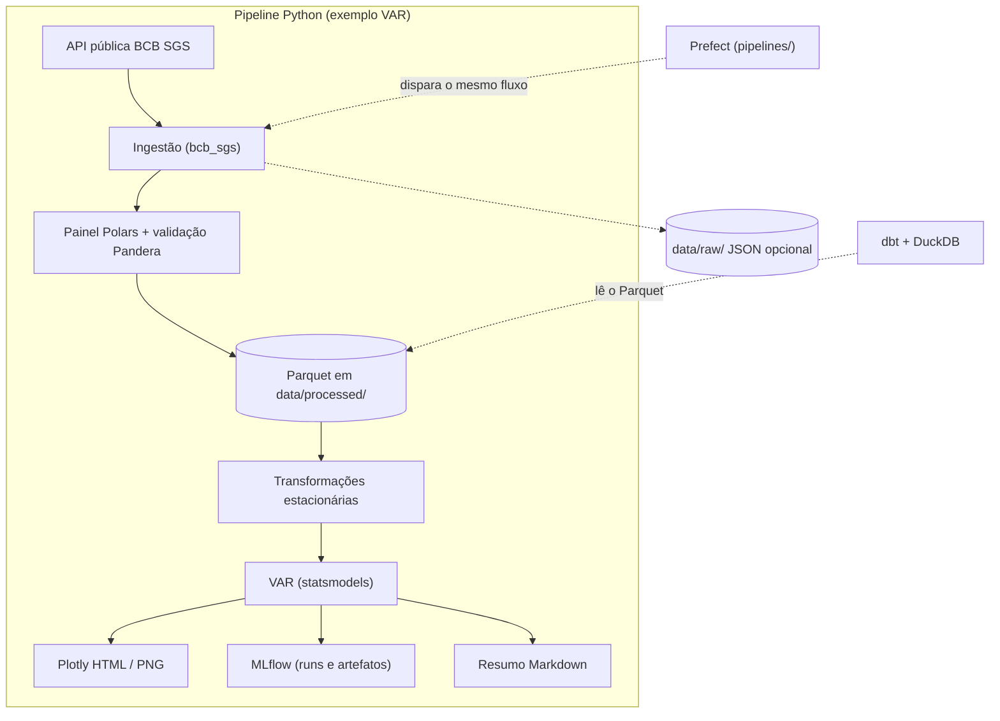

# macroeconomia

Repositório de **estudos e automação em macroeconomia**: coleta de séries (BCB SGS), ETL com Polars/Pandera, modelos de séries temporais (ex.: VAR), visualização (Plotly), rastreio no MLflow e orquestração com Prefect.

## Como rodar em 30 segundos

1. **Clone** o repositório e copie variáveis de exemplo: `cp .env.example .env` (opcional para o modo demo — vê-se abaixo).
2. **Local (uv)** — instala deps de dev + app: `uv sync --group dev` (ou conforme Makefile `make install`).
   - Um **painel Streamlit diário** lê `data/processed/macro_ipca_selic.parquet`; se esse arquivo não existir, usa `data/demo/macro_ipca_selic.parquet` (contrato Pandera igual ao ETL). O demo já vem no repositório; para regenerá-lo: `make demo-panel`.
   - Abrir o dashboard: na raiz, `PYTHONPATH=src streamlit run dashboard/streamlit_app.py` (Linux/macOS) ou `$env:PYTHONPATH="src"; streamlit run dashboard/streamlit_app.py` (PowerShell).
3. **Docker** — build multi-stage inclui CLI do pipeline (`macro-var-example`) e o painel: `docker compose up --build` sobe apenas o **Streamlit** em `http://localhost:8501`; para rodar o pipeline na imagem: `docker compose --profile pipeline run --rm macro`.

O README detalha MLOps (MLflow Registry, drift no ETL, manifesto ao lado do Parquet) mais abaixo.

## Fluxo de dados (visão geral)

O diagrama abaixo resume o **exemplo VAR IPCA × Selic** (`macro-var-example`): da API do Banco Central ao armazenamento analítico, modelagem e artefatos. **Prefect** e **dbt** são caminhos opcionais (agendamento e transformações declarativas em cima do Parquet).



## Notebook exploratório

O arquivo [`Análise_PIB.ipynb`](Análise_PIB.ipynb) permanece como **análise exploratória** legada no repositório. Use-o para ideias e gráficos ad hoc; pipelines reproduzíveis e testados ficam em `src/macroeconomia/` e nos fluxos em `pipelines/`.

## Requisitos

- Python **3.11+** (recomendado alinhar com o CI em `.github/workflows/ci.yml`).
- Opcional: [uv](https://docs.astral.sh/uv/) (o `Makefile` assume `uv` por padrão).

## Instalação

Na raiz do repositório:

```bash
# Com uv (recomendado)
uv sync --group dev

# Ou com pip
python -m pip install -e ".[dev]"
```

Copie variáveis de ambiente de exemplo:

```bash
cp .env.example .env
```

## Executar o exemplo VAR (IPCA × Selic)

Requer acesso à API pública do BCB. Gera Parquet em `data/processed/`, artefatos em `data/processed/artifacts/`, run no MLflow local (`mlruns/`) e relatório Markdown.

O pipeline inclui, entre outros: **retries exponenciais** na ingestão SGS, **auditoria** de painel (sem imputação automática), **métricas OOS** (corte temporal 85/15), **IRF** (com *fallback* se a ortogonalização for singular), **FEVD** (texto), **Granger** e checagem de **estabilidade** das raízes; ver `run_var_inflation_pipeline` em `src/macroeconomia/examples/var_inflation_pipeline.py`.

```bash
# Com uv
uv run macro-var-example

# Ou, com o pacote instalado
macro-var-example
```

## Exemplo ARIMA (inflação mensal, univariado)

Ajusta um ARIMA em ``d_ln_ipca`` após baixar o IPCA (SGS ``433``) via fonte BCB. Registra métricas no MLflow (experimento sufixo ``_arima``) e exporta um gráfico HTML.

```bash
uv run macro-arima-example
```

## Ingestão multi-fonte (médio prazo)

- **Contrato**: `MacroSeriesSource` em `src/macroeconomia/ingestion/sources.py` com implementações **BCB SGS** (`BcbSgsSource`), **FRED** (`FredSource`, requer `pip install -e ".[data-sources]"` e `FRED_API_KEY`) e **World Bank** (`WbdataSource`, mesmo extra `data-sources`, indicadores WB como `NY.GDP.MKTP.CD`, país padrão `BR`).
- **Tipos neutros**: `SeriesObservation` + helpers em `ingestion/series_types.py`.
- **Atalho**: `fetch_series_observations("bcb_sgs", "433")`, `get_series_source("fred", api_key=...)` ou `fetch_series_observations("wbdata", "NY.GDP.MKTP.CD", country="US")`.

## Modelos de série adicionais

- **ARIMA em grade**: `fit_arima_grid` (statsmodels).
- **ARIMA automático**: `fit_arima_auto_pmdarima` com extra `[arima-auto]` (`pmdarima`).
- **Nível local (espaço de estados)**: `fit_local_level` em `models/time_series/local_level.py` (statsmodels `UnobservedComponents`).
- **Bayes mínimo (Normal, variância conhecida)**: `sample_posterior_mean_known_sigma` com extra `[bayesian]` (`numpyro`, `jax`); o arquivo correspondente está fora do limiar de cobertura do CI para evitar dependência pesada no runner padrão.

## Volatilidade (GARCH opcional)

Com o extra ``[volatility]`` (`arch`), use `macroeconomia.models.volatility.fit_garch_11` para GARCH(1,1) em retornos/inovações. O teste `tests/test_garch_optional.py` é ignorado se `arch` não estiver instalado.

## Dashboard (Streamlit)

Com o extra ``[dashboard]`` (ou grupo ``dev`` no CI): `uv sync --group dev`. Na raiz, com `PYTHONPATH=src`:

```bash
streamlit run dashboard/streamlit_app.py
```

- **Arquitetura**: `dashboard/streamlit_app.py` orquestra apenas; `dashboard/data_loader.py` resolve caminhos demo/processado, manifesto e contrato Pandera; `dashboard/charts.py` concentra Plotly.
- **Dados**: prefere `MACRO_DATA_PROCESSED_DIR` / `macro_ipca_selic.parquet`; se ausente, faz **fallback** para `data/demo/macro_ipca_selic.parquet` (versionado). ``MACRO_DEMO_MODE=true`` força sempre o demo.
- **Atualização**: botão lateral executa `python -m macroeconomia.examples.var_inflation_pipeline` (ETL desacoplado; requer rede para o BCB).
- **Sidebar**: última atualização (manifesto ao lado do Parquet), prévia SHA256 do dataset Git commit SHA (`MACRO_GIT_COMMIT` / `GIT_COMMIT` no build Docker).
- **Cache**: TTL de ~12 h (`st.cache_data`; alinha com ``MACRO_DASHBOARD_CACHE_TTL_SECONDS`` no backend).

Docker (na raiz): ``docker compose up --build`` — sobe o serviço Streamlit (`dashboard`) na porta **8501**; monta `./data` e `./mlruns`.

### MLOps (VAR vs ARIMA)

| | **VAR IPCA × Selic** (`macro-var-example`) | **ARIMA `d_ln_ipca`** (`macro-arima-example`) |
|---|--------------------------------------------|------------------------------------------------|
| **Experimento MLflow** | `MACRO_MLFLOW_EXPERIMENT_NAME` (ex.: ``macroeconomia``) | sufixo ``_arima`` no mesmo campo base |
| **Tags** | `git_commit`, `dataset_sha256` do Parquet de nível, `pipeline=var_ipca_selic` | `git_commit`, `dataset_sha256` da série endógena (**hash SHA‑256 dos bytes float64 de `y`**) , `pipeline=arima_ipca` |
| **Artefactos** | Parquet nível + figuras IRF/etc. + **`daily_manifest.json`** ao lado do processado | gráfico HTML + **`arima_ipca_mlflow_metadata.json`** (ordem (p,d,q), ICs, grid) |
| **Modelo UI (pyfunc)** | VAR 1‑passo; colunas = endógenes estacionarizadas | ARIMA 1‑passo `forecast`; coluna técnica `history_stub` no input exemplo |
| **Model Registry** | ``MACRO_MLFLOW_REGISTERED_MODEL_NAME`` não vazio | ``MACRO_MLFLOW_ARIMA_REGISTERED_MODEL_NAME`` não vazio (por defeito vazio ⇒ só artefactos + pyfunc no run, sem registar versão global) |

**VAR**: drift no ETL sobre níveis; **ARIMA**: sem drift automático neste exemplo (serie já transformada ao ajustar). **Segredos**: não registar chaves de API em Runs ou logs Prefect; uso de `.env` / segredos de orquestração.

Smoke tests CI: `tests/test_mlflow_pyfunc_smoke.py` valida ``load_model`` + ``predict`` com tracking ``file:/`` temporário (sem servidor remoto).

## Estrutura (resumo)

| Caminho | Conteúdo |
|--------|----------|
| `src/macroeconomia/` | Pacote: `config`, `ingestion`, `processing`, `models`, `evaluation`, `visualization`, `examples` |
| `tests/` | Pytest + cobertura mínima configurada no `pyproject.toml` |
| `dashboard/` | Painel Streamlit (orquestrador + `data_loader` + `charts`) |
| `scripts/` | Utilitários (`gen_demo_panel.py` para Parquet demo) |
| `pipelines/` | Fluxos Prefect (ex.: `prefect_var_flow.py`) |
| `dbt/` | Projeto dbt de exemplo (DuckDB); ver `profiles.yml.example` |
| `docker/` | Imagem de execução reproduzível |
| `.github/workflows/ci.yml` | CI: ruff, black, mypy, pytest + cobertura |

## Qualidade de código (espelho do CI)

O workflow do GitHub Actions executa, em sequência: **ruff** → **black --check** → **mypy** → **pytest** (com limiar de cobertura).

Localmente, o equivalente prático é:

```bash
make lint          # ruff
make format        # ruff --fix + black
make typecheck     # mypy
make test          # pytest (com --cov conforme pyproject.toml)
```

Sem `make` (Windows PowerShell), use os mesmos comandos via `uv run` ou `python -m`, por exemplo:

```powershell
uv run ruff check src tests pipelines dashboard
uv run black --check src tests pipelines dashboard
uv run mypy src/macroeconomia
uv run pytest
```

## Pre-commit

```bash
uv run pre-commit install
uv run pre-commit run --all-files
```

## Docker

```bash
docker compose build
docker compose run --rm macro
```

O serviço monta `./data` e `./mlruns` no container para persistir saídas.

## dbt (opcional)

Instale o grupo opcional (com uv: `uv sync --group analytics`) ou `pip install dbt-core dbt-duckdb`. Copie `dbt/profiles.yml.example` para `~/.dbt/profiles.yml` (ou use `--profiles-dir`) e ajuste caminhos ao Parquet gerado pelo pipeline Python.

## Licença

MIT (ver `pyproject.toml`).
